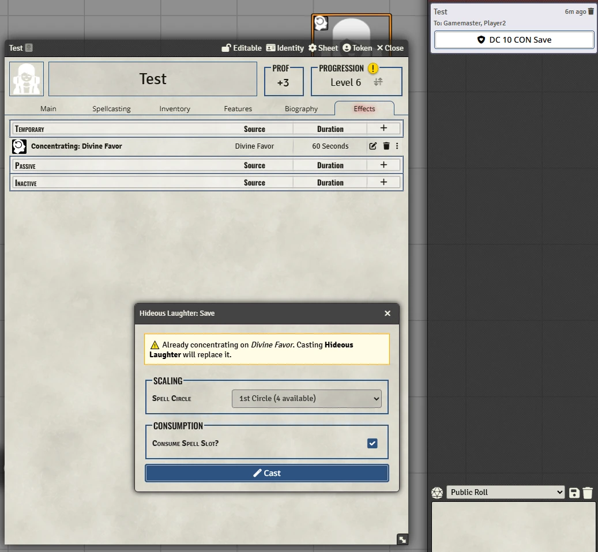

# Black Flag QOL
A module designed to enhance the management of the Concentration condition when using the Black Flag system. It detects when a concentration activity is used and automatically creates a Concentrating effect, and send a CON save message if an Actor with the Concentrating effect takes damage.

## Features
- Automatically applies a Concentration effect when a spell with the Concentration tag is cast.
- Prompts a warning if the actor is already concentrating when a spell with the Concentration tag is cast.
- Effect name includes the spell being concentrated on (e.g., "Concentrating: Divine Favor").
- Generates a CON save message for maintaining concentration after taking damage.

## Installation
### Method 1
1. Launch Foundry
2. Go to the "Add-on Modules" tab of the setup screen
3. Click "Install Module"
4. Search for "Black Flag QOL" in the pop up window.
5. Click "Install"

### Method 2
1. Launch Foundry
2. Go to the "Add-on Modules" tab of the setup screen
3. Click "Install Module"
4. Paste the following manifest into the "Manifest URL" field: `https://github.com/Niii989/bf-qol/releases/latest/download/module.json`
5. Click "Install"

## Future Plans
- Link spell effects (like Bless) to the Concentrating effect, so that if concentration is broken, the associated spell effects are also removed.
- Automatically adds activities for weapon options when the item has the property checked.
- Tracks reactions via an effect when an actor takes an action outside of their turn.
